# C# Console Applications
This repository showcases small C# console applications designed for beginners.

## Context
This repository contains a collection of simple yet functional C# console applications. These projects are aimed at helping beginners understand fundamental concepts in C# programming. Each application is self-contained and focuses on a specific task or problem, offering a practical way to apply C# skills. The applications demonstrate basic programming techniques such as string manipulation, LINQ queries, file handling, and mathematical calculations. Users can explore these projects to learn and practice C# in a console environment.

## Table of Contents
- [C# Console Applications](#c-console-applications)
- [Context](#context)
- [City Finder](#prg521_fa2_question1---city-finder)
- [Password Generator](#prg521_fa4_passwordgenerator---password-generator)
- [LINQ Query](#prg521_fa2_question2---linq-query)
- [Rent or Buy a Propery](#prg521---rent-or-buy-a-property)
- [SalesTaxCalculator](#salestaxcalculator)

## PRG521_FA2_Question1 - (City Finder)
### Overview
This program uses LINQ and C# to find strings that start and end with specific characters.

  Tasks to complete: 
- Use an array containing 10 South African cities: Butterworth, Mthatha, Jagersfontein, Kroonstad, Boksburg, Soweto, Empangeni, Polokwane, Secunda, Kuruman.
- Display a welcome message to inform users about the application.
- Show all available cities.
- Prompt the user to enter a starting character for a city.
- Prompt the user to enter an ending character for a city.
- Display the output based on the specified starting and ending characters.

### Demonstrating functionality
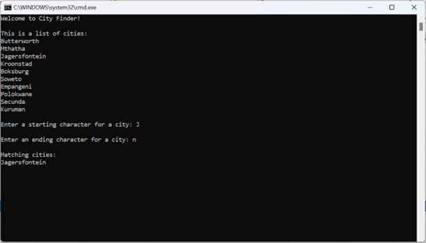

## PRG521_FA4_PasswordGenerator - (Password Generator)
### Overview
This application generates passwords based on a user's full name. The company that hired you requires the application to:

The password is created using the following rules:  
- Exclude the letters ‘a’, ’e’, and ‘t’ from the password.
- Add each vowel (except ‘a’ and ‘e’) twice.
- Replace spaces with the string 'S&?'.
- Retain all other characters.
- End the password with the total number of excluded letters.

### Demonstrating functionality
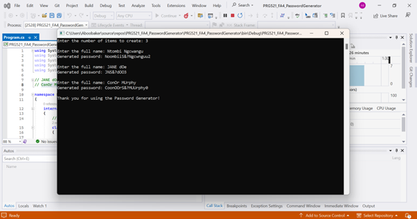

## PRG521_FA2_Question2 - (LINQ Query)
### Overview
This section involves answering questions by writing LINQ queries.

### Demonstrating functionality
Retrieve the names of all students with at least one grade of 90 or higher:

`var studentNames = courses
                .SelectMany(c => c.Students)
                .Where(s => s.Grades.Any(g => g >= 90))
                .Select(s => s.Name);`

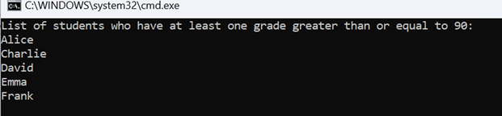

  Calculate the average grade of all students in each course:

`var courseAvgGrades = courses
                .Select(c => new
                {
                    CourseName = c.Name,
                    AverageGrade = c.Students.Average(s => s.Grades.Average())
                }).ToList();`

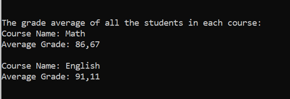

  Retrieve the names of all courses where every student has at least one grade of 80 or higher:

`var coursesNames = courses
                .Where(c => c.Students.All(s => s.Grades.Any(g => g >= 80)))
                .Select(c => c.Name)
                .ToList();`

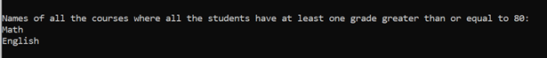

  Retrieve the name and age of the student with the highest average grade across all courses:

`var topStudent = courses
                .SelectMany(c => c.Students)
                .OrderByDescending(s => s.Grades.Average())
                .First();`

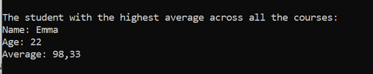

## PRG521 - (Rent or Buy a Property)
### Overview
This application helps a user determine whether they should rent or buy a property. The user inputs their gross monthly income, estimated tax, and monthly expenditures. They can choose to either rent or buy a property:

- **Renting**: Input the monthly rental amount.
- **Buying**: Input the purchase price, deposit, interest rate, and repayment period. The application calculates the monthly home loan repayment and checks if it exceeds one-third of the gross monthly income.

The application includes internationally acceptable coding standards, with detailed comments explaining the code.

### Demonstrating functionality
Prompt user for gross monthly income:  

Prompt user for estimated monthly tax deduction:  

Prompt user for estimated monthly living expenses:  
a.   

b.   

Prompt user to choose between renting or buying:  

Prompt user for monthly rental amount (if renting):  

Prompt user for purchase price (if buying):  

Prompt user for total deposit amount (if buying):  

Prompt user for interest rate (if buying):  

Prompt user for number of months for repayment:  

Calculate available monthly funds (if renting):  

Calculate monthly home loan repayment amount:  

Display alert if home loan repayment > 1/3 of income:  

Calculate available monethly funds (if buying):  

Take Note that validation is also built in the entire application.

## SalesTaxCalculator

### Overview
This Windows application calculates sales tax for a given amount. The user enters an amount and selects a sales tax rate between 0 and 25%. The application then calculates and displays the tax and total amount. It includes exception handling to manage invalid inputs and saves both exception messages and tax calculations to text files.

### Demonstrating functionality
Exception handling should be used to prevent users from entering invalid input (text, character...) (try, catch, and finally)
  a. Exception handling for when a user inputs text: 
  

b. Exception handling for when the user inputs a character: 
  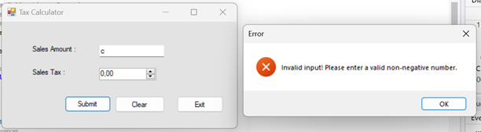

All exception messages should be displayed using a message box and saved in a text file called Exceptionfile.txt
  a. Additional error handling for when the user does not input any value: 
  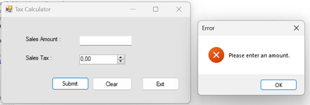

b. Additional error handling for when the user inputs a negative value: 
  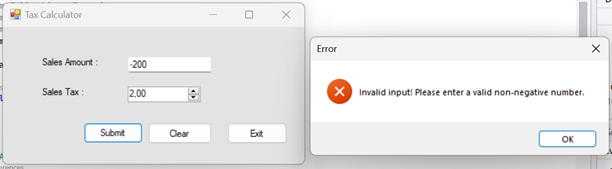

All results should be saved in a file called TaxCalculation.txt. The result should be saved once the Submit button is pressed
  a. First entry: 
  

b. Second entry: 
  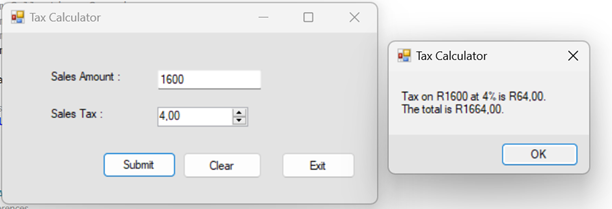

c. Third entry: 
  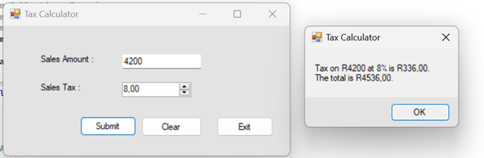

Meaning your program will have two separate text files one to record all exceptions thrown – message and the other to record all tax calculations and the date and time the operation occurred
  a. ExceptionFile.txt: 
  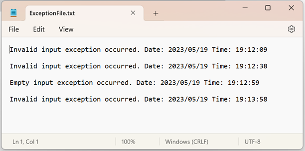

b. TaxCalculation.txt: 
  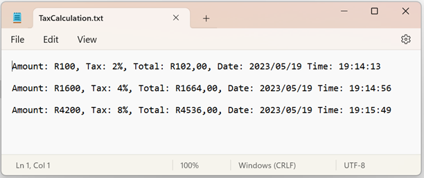

c. Additionally, the Clear button: 
  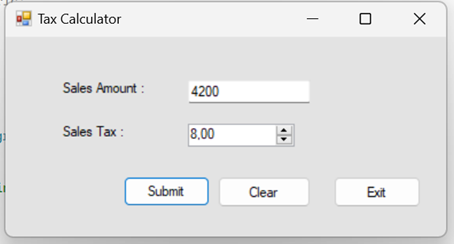

d. The Clear button clears the Amount textbox: 
  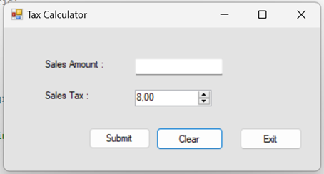
